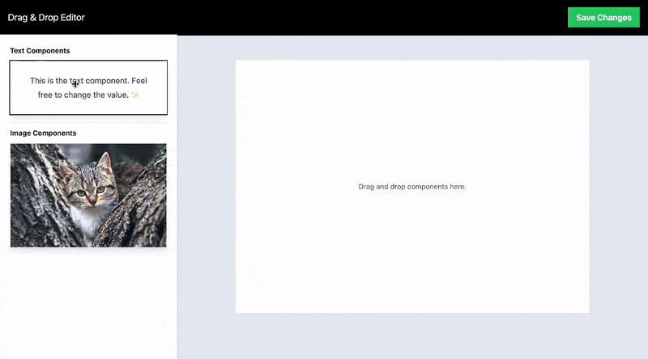
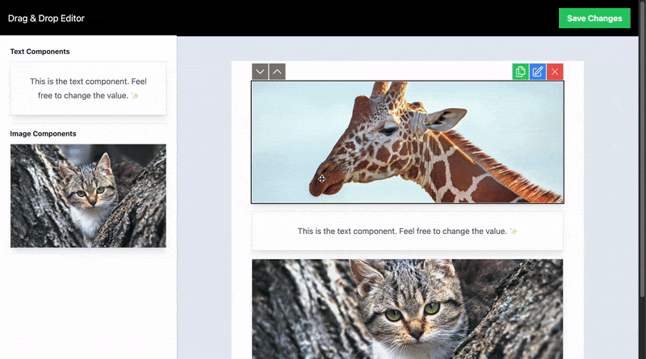
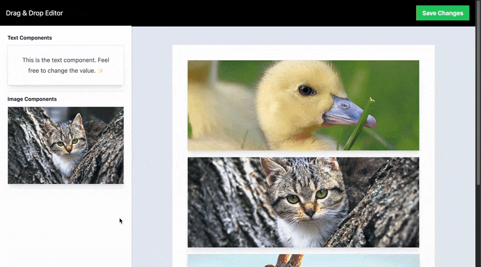
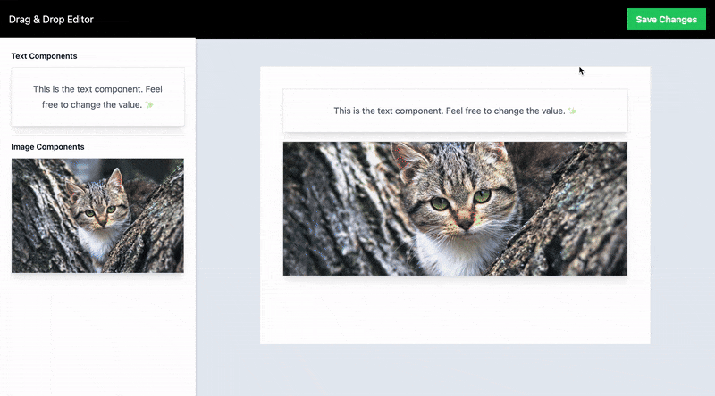
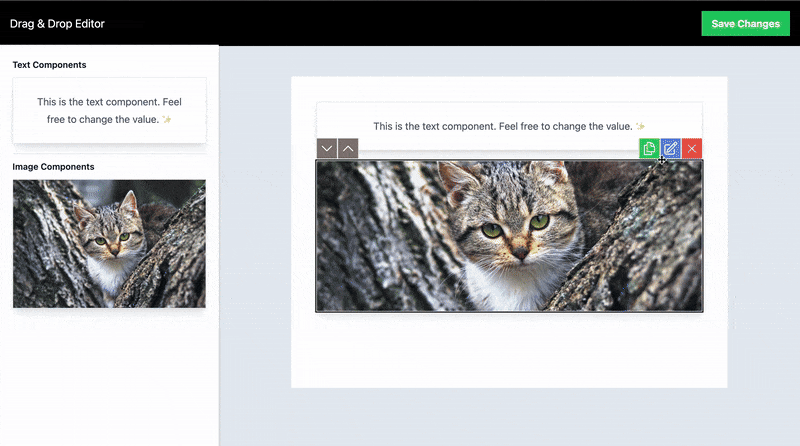
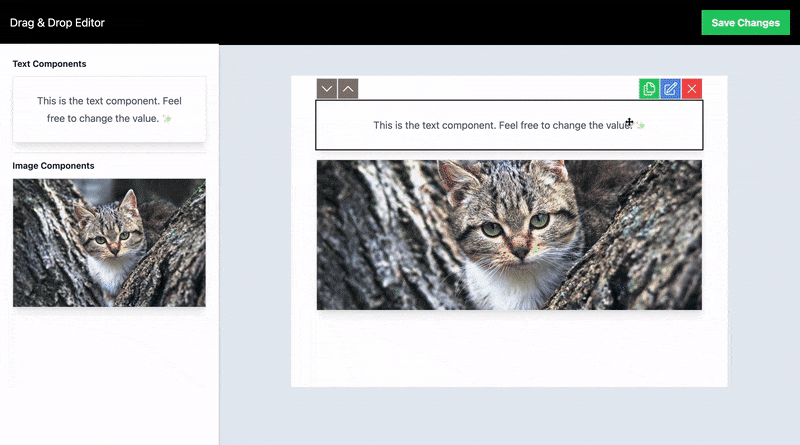
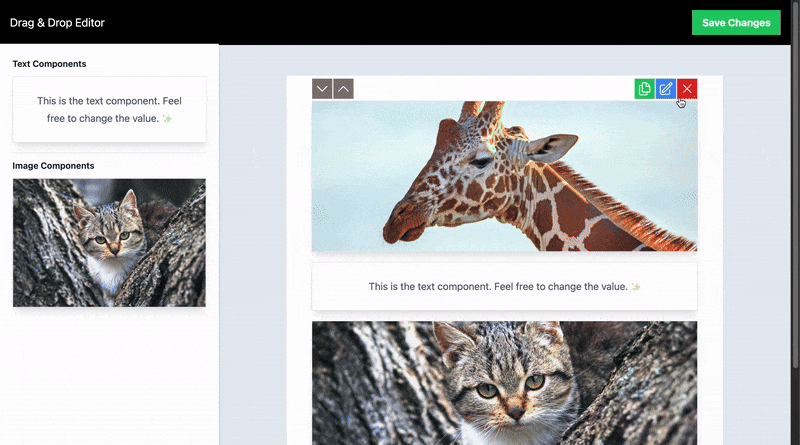
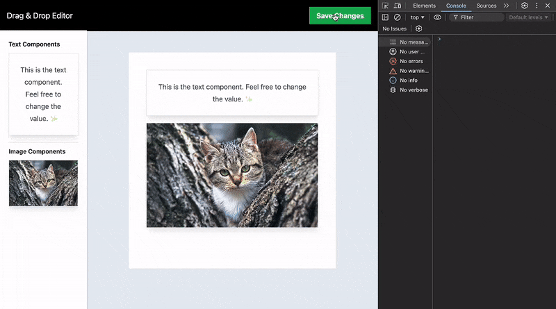

# Drag and Drop Editor

Sample project that includes drag-and-drop functionality for both text and image components.

### Overview

- [Development Environment Setup](#development-environment-setup)
- [How To Use (Instructions)](#how-to-use)
- [Test Coverage](#test-coverage)

## Development Environment Setup

This repository is designed to use a development container.

### Prerequisites

The prerequisites for working on this repo are:

- Docker Desktop (MacOS, Windows) or docker engine (Linux)
- GIT
- VS Code
- VS Code Extension "Remote Development"

All other prerequisites are provided by the dev container and its dependencies.

VSCode and other IDEA-based IDEs can use devcontainers to set up the development environment. Simply open the project in the IDE and choose the 'Open in Container' option to get started.

### Install dependencies

```bash
npm ci
```

### Compile and Hot-Reload for Development

```sh
npm run dev
```

### Run Unit Tests with [Vitest](https://vitest.dev/)

```sh
npm run test:unit
```

### Lint with [ESLint](https://eslint.org/)

```sh
npm run lint
```

## How To Use

This section provides instructions on how to use the application. Please follow the steps outlined below to get started.

### Insert a block by dragging

To use this feature, click and hold the block in the picker on the left side of the screen, then drag it to the container on the right side. Once positioned, release the block to drop it into the container.



### Change order of added blocks

To use drag functionality, hold down the mouse button and drag the corresponding block up or down.



To use the buttons, hover over the corresponding clock and click on the sort buttons that appear at the top-left corner of the block.



### Duplicate a block

Hover over the corresponding block and click on the green button that appears in the top-right button group of the block.



### Update block content

Hover over the corresponding block and click on the blue button that appears in the top-right button group of the block.




### Remove a block

Hover over the corresponding block and click on the red button that appears in the top-right button group of the block.



### Submit added block status to console

After adding the blocks, click on the "Save Changes" button located in the top-right corner of the screen. This will export a config object containing the added blocks to the console.


```
blockType - Type of the added block (Text or Image)
order - Sorting order of the added block
text - Text content of the block (This will only appear for text blocks)
imageUrl - Url of the image added to the block (This will only appear for image blocks)
```



## Test Coverage

Unit tests have been added for all components of the application and are located in a folder named __tests__, placed in the same directory as the corresponding component.


